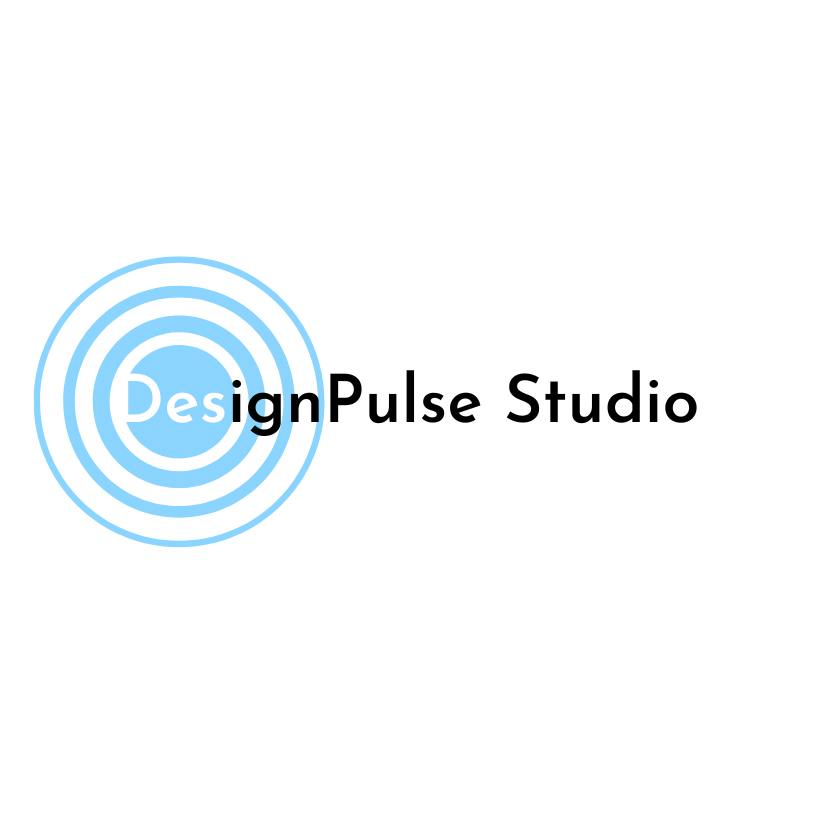

# DesignPulseStudio.com

## About Us
Welcome to **DesignPulseStudio.com**, a Hartford, CT-based design agency founded by Eric King. We specialize in crafting modern digital solutions—landing pages, mobile apps, and branding—to help small businesses thrive. Our goal? Turn inefficiencies into opportunities with exceptional design.

## The Problem We Solve
Many businesses struggle with **inefficient processes and outdated technology**, costing them time, money, and growth. In 2025, a strong, streamlined digital presence is essential. We tackle this by optimizing the tools businesses use every day—making them faster, smarter, and more user-friendly.

## Our Core Service: Digital Experience Optimization
With **Digital Experience Optimization**, we redesign digital interfaces and workflows to boost efficiency and satisfaction. Here’s what we bring to the table:

### Key Offerings
- **UI/UX Redesign for Internal Tools**  
  Modernize clunky systems to save time and reduce frustration.  
  _Example_: A sleek dashboard cutting task time by 30%.

- **Customer-Facing App & Website Optimization**  
  Enhance usability to drive engagement and conversions.  
  _Example_: A simplified checkout boosting sales by 20%.

- **Workflow Visualization & Improvement**  
  Identify bottlenecks and design streamlined solutions.  
  _Example_: An automated onboarding flow saving hours weekly.

- **Tech Collaboration**  
  We team up with developers to integrate our designs seamlessly.  
  _Example_: A custom app UI paired with your existing systems.

### Extras
- **Digital Experience Audits**: We assess your tools and suggest upgrades.  
- **Industry Focus**: Tailored solutions for healthcare, retail, and more.

## Other Services
- **Landing Pages**: High-conversion designs built fast in Webflow.  
- **Mobile Apps**: iOS/Android apps with features like scheduling or loyalty tracking.  
- **Branding**: Standout logos, colors, and typography.

## Why Choose Us
- **Small Business Savvy**: We get the challenges you face—we’re one too!  
- **Design That Delivers**: Beautiful solutions with measurable impact.  
- **Client-First**: Your success is our priority.

## How It Works
1. **Chat**: Tell us your goals and pain points.  
2. **Design**: We craft tailored, modern solutions.  
3. **Launch**: Get your optimized tools with zero hassle.

## Portfolio Sneak Peek
- *Chiropractor App*: A clean app with booking and health tips.  
- *Lawyer Landing Page*: Bold design driving consultation signups.  
- *Car Wash Site*: Vibrant UI with loyalty integration.  

## Get Started
Ready to modernize your business?  
- **Contact**: Visit [DesignPulseStudio.com](https://designpulsestudio.com) or DM us on X @DesignPulseHQ.  
- **Free Demo**: Ask for a no-strings-attached landing page mockup to see our work in action!

## Tech Stack
- **Design**: Figma for mockups, Adobe Suite for branding.  
- **Development**: Webflow for sites, collaboration with devs for apps.  
- **Process**: Agile workflows to keep things fast and flexible.

## Our Vision
We’re here to help small businesses compete in a digital world. By solving inefficiencies with design, we aim to be your trusted partner in growth.

## Contribute
Got feedback or ideas? Open an issue or PR—we’d love to hear from you!

---
*Updated: March 18, 2025*  
*License: MIT (if applicable—adjust as needed)*